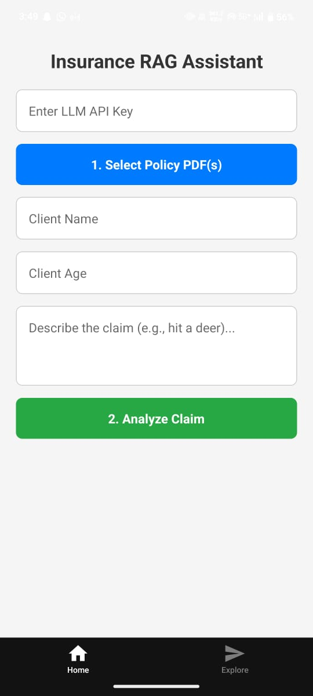
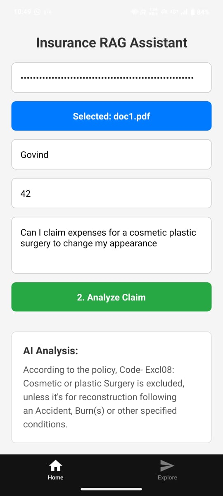
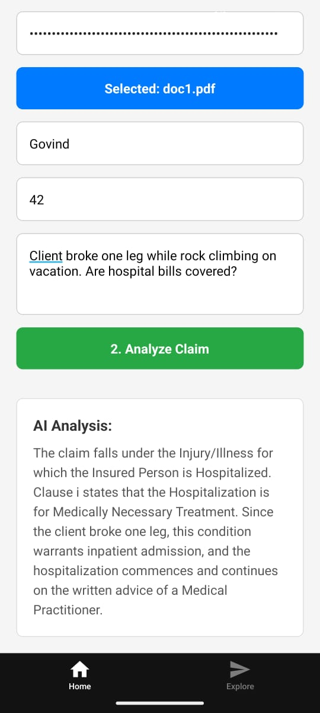

# AI-Powered Insurance Claims Assistant (RAG Mobile App)

A full-stack mobile application designed to help insurance agents instantly verify claim coverage by chatting with policy documents. Built with a React Native frontend and a Python/FastAPI backend, this app uses Retrieval-Augmented Generation (RAG) to ensure the AI's answers are strictly grounded in the uploaded PDF documents, eliminating hallucinations.

  
  
  

---

## Real-World Use Case: The Centralized Agency Model

This architecture is specifically designed for real-world insurance agencies:

* **The Server:** A single, powerful computer at the agency headquarters runs the Python backend and FAISS vector database. This server handles the heavy lifting of processing massive PDF documents and embedding text.
* **The Agents:** Field agents install the lightweight Expo app on their mobile phones. They simply connect to the central server's IP address.
* **The API Keys:** To manage rate limits and billing, agents can input their own individual Groq API keys (or a company-provided key) directly into the app before analyzing a claim.
* **The Workflow:** An agent at a client's house can select multiple policy PDFs, input the client's age and claim details, and get an instant, legally grounded answer on whether the claim is covered, without needing a high-end laptop.

---

## Tech Stack

### Frontend (Mobile App)
* **Framework:** React Native (Expo Router)
* **File Handling:** `expo-document-picker` (Multi-file support)
* **Networking:** Fetch API (`FormData` for multipart file uploads)

### Backend (API & AI)
* **Server:** Python, FastAPI, Uvicorn
* **AI Orchestration:** LangChain
* **Vector Database:** FAISS (Facebook AI Similarity Search)
* **Embeddings:** HuggingFace (`all-MiniLM-L6-v2` running locally)
* **LLM:** Meta Llama 3.1 8B (Served via Groq API for ultra-low latency)

---

## How to Run the Project Locally

### Prerequisites
* Python 3.9+
* Node.js & npm
* Expo Go app installed on your physical mobile device
* A free [Groq API Key](https://console.groq.com/)

### 1. Start the Backend (Python)
Open a terminal and navigate to your `backend` folder.

\`\`\`bash
## Create and activate a virtual environment (optional but recommended)
python -m venv venv
### Windows: venv\Scripts\activate
### Mac/Linux: source venv/bin/activate

## Install dependencies
pip install fastapi uvicorn pydantic python-multipart langchain langchain-community langchain-groq langchain-huggingface faiss-cpu pypdf

## Start the server (CRITICAL: Use 0.0.0.0 to expose it to your local network)
python -m uvicorn main:app --host 0.0.0.0 --port 8000
\`\`\`

### 2. Configure the IP Address (CRITICAL STEP)
Before starting the frontend, you must tell the mobile app where to find the Python server.

1. Open a command prompt/terminal and find your computer's IPv4 address.
   * **Windows:** Run `ipconfig` (Look for Wireless LAN adapter Wi-Fi or Mobile Hotspot).
   * **Mac:** Run `ifconfig | grep inet`.
2. Open `mobile/app/(tabs)/index.js`.
3. Go to the line defining `BACKEND_URL` and update it:

\`\`\`javascript
// Change this to your computer's exact IP address
const BACKEND_URL = 'http://10.50.18.44:8000'; 
\`\`\`

**Laptop vs. Mobile Setup:**
* **Using a Physical Phone:** You must use your computer's actual Wi-Fi or Hotspot IP address (e.g., `192.168.x.x` or `10.50.x.x`). Both your phone and laptop must be on the same network.
* **Using a Desktop Emulator:** If you are running an Android Emulator on the exact same laptop as the backend, you can usually set this to `http://10.0.2.2:8000`.

### 3. Start the Frontend (Expo)
Open a new terminal and navigate to your `mobile` folder.

\`\`\`bash
## Install Node dependencies
npm install

## Start the Expo server in LAN mode
npx expo start --lan
\`\`\`
Scan the QR code that appears in the terminal using the **Expo Go** app on your phone.

---

## System Guardrails

The backend `rag_engine.py` is hardcoded with strict systemic guardrails:

1. **Zero Hallucination:** The AI is instructed to never invent clause numbers or coverage amounts.
2. **Missing Info Protocol:** If an irrelevant document is uploaded (like a recipe or manual), the AI is forced to reply: *"I cannot find the answer to this claim in the uploaded document."*
3. **No JSON:** Responses are forced into conversational text for readability by the agent.
